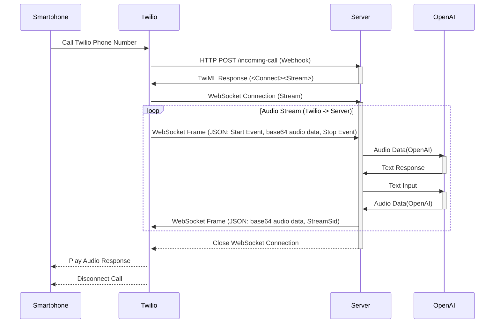

# twilio-openai-realtime-call

> The App opens up Speech to Speech (S2S) capabilities for their GPT-4o multimodal model, which supports direct audio input and output – avoiding translating back and forth from text with a speech-to-text (SST) or text-to-speech (TTS) step.

To install dependencies:

```sh
bun install
```

## Development

ローカルサーバーを起動します:

```sh
bun run dev
```

[ngrok](https://dashboard.ngrok.com/)を使ってローカルホストをhttps URLとしてプロキシし、Webhookで叩けるようにします。ngrokは開発者がローカルの開発サーバー（localhost）をインターネットに公開することを可能にするトンネリング/リバース・プロキシツールです。

```sh
# ngrok http --domain=[YOUR_DOMAIN] [転送先IP]
ngrok http --domain=gladly-discrete-hound.ngrok-free.app http://localhost:3000
```

ref. [【簡単】ngrokで発行されるURLを固定する](https://zenn.dev/y_taiki/articles/ngrok_domain)

## Sequence Diagram



### 処理の流れ

1. クライアントからTwilioで発行した指定の電話番号へCall
1. Twilio は着信をトリガーにWebhookが発火しサーバーエンドポイント`/incoming-call`が実行
1. `/incoming-call`ではWebSocket URLを指定したTwiMLを作成しレスポンスを返却
1. Twilio は、サーバーから受け取った TwiML レスポンスを解析
    - `<Connect><Stream>` の検出: Twilio は`<Connect>`の中に`<Stream>`タグを見つけ、`<Stream>` 動詞の url 属性で指定された URL にWebSocket接続
1. WebSocket 接続が成功すると、Twilio は通話中の音声データを継続的に WebSocket で`<Stream>`で指定したURLにメッセージを送信
1. Twilioから受け取った音声データをOpenAI Realtime APIで処理し返答用の音声データを取得
1. 返答用音声データをTwiML形式に変換することで、音声データが流れてくる度に自動応答が発話される（以下ループ）
1. 通話が終了するか TwiML で終了指示があるとWebSocket接続は切れ通話は終了

## WebSocketの動作確認方法

[Websocat](https://github.com/vi/websocat)というコマンドラインでWebSocketの簡単な接続確立とメッセージ送受信ができるツールを使うのが楽です。

```sh
# WebSocketのエンドポイントを指定し接続確立
# その後接続確立している状態でターミナル上でメッセージを入力+Enter押下するとメッセージが送信される
websocat ws://localhost:3000/ws
```

## onMessageで受け取るTwilioの音声インプットデータの形式例

ref. [Media Streams - WebSocket Messages | Twilio](https://www.twilio.com/docs/voice/media-streams/websocket-messages)

```yaml
{
  "event": "media",
  "sequenceNumber": "926",
  "media": {
    "track": "inbound",
    "chunk": "925",
    "timestamp": "18553",
    "payload": "fn5+fn5+fn5+fn5+fn5+fn5+fn5+fn5+fn5+fn5+fn5+fn5+fn5+fn5+fn5+fn5+fn5+fn5+fn5+fn5+fn5+fn5+fn5+fn5+fn5+fn5+fn5+fn5+fn5+fn5+fn5+fn5+fn5+fn5+fn5+fn5+fn5+fn5+fn5+fn5+fn5+fn5+fn5+fn5+fn5+fn5+fn5+fn5+fn5+fn5+fn5+fn5+fn5+fg=="
  },
  "streamSid": "MZ893cd917cb56661c1c498970e1fe3e08"
}

```

## References

- [Build an AI Voice Assistant with Twilio Voice, OpenAI’s Realtime API, and Node.js | Twilio](https://www.twilio.com/en-us/blog/voice-ai-assistant-openai-realtime-api-node)
- [(41) How to build a voice assistant using OpenAI Realtime API + Twilio Voice + Python - YouTube](https://www.youtube.com/watch?v=OVguB1h-eTs)
- [Realtime APIとTwilioを用いた電話予約デモシステムの構築 | 株式会社AI Shift](https://www.ai-shift.co.jp/techblog/4980)
- [【リアルタイム音声通話】OpenAI Realtime APIとTwilioで実装する：とりあえず動かすための簡単ガイド](https://zenn.dev/shurijo_dot_com/articles/a6a8710f2ecc53)
- [Realtime APIでAIが応答する電話窓口を実現。 技術部ブログ | 株式会社インターパーク Interpark., Co. Ltd.](https://www.interpark.co.jp/dev/p0503.htm)
- [twilio-samples/live-translation-openai-realtime-api: Integrate AI-powered voice translation into a Twilio Flex contact center using our prebuilt starter app, enabling live conversations between agents and customers speaking different languages.](https://github.com/twilio-samples/live-translation-openai-realtime-api)
  - リアルタイム翻訳のTwilio公式サンプル
- [Twilio Streamingデータを用いたユーザー発話へのリアルタイム音声処理 | 株式会社AI Shift](https://www.ai-shift.co.jp/techblog/2844)
- [OpenAI の Realtime API で音声を使って任意の関数を実行する(Function calling編) | 豆蔵デベロッパーサイト](https://developer.mamezou-tech.com/blogs/2024/10/09/openai-realtime-api-function-calling/)
